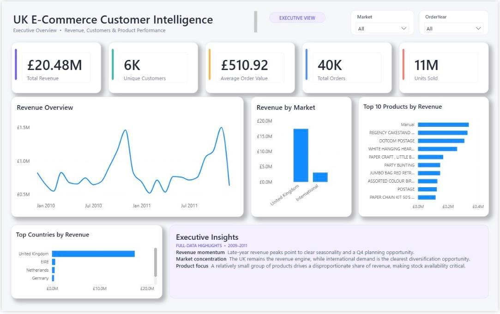
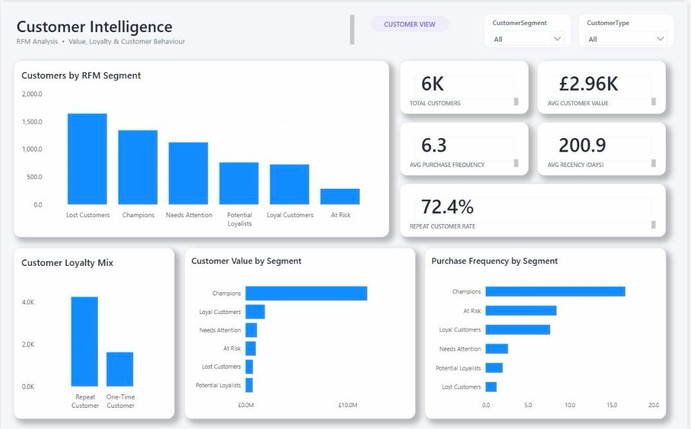
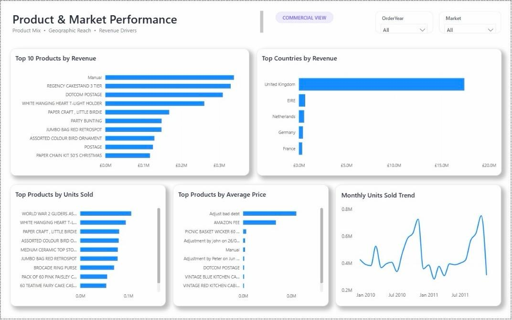

# UK E-Commerce Customer Intelligence

An end-to-end data analytics project analysing more than one million UK e-commerce transaction records to uncover revenue trends, customer behaviour, product performance and geographic opportunities.

The project demonstrates a complete analytics workflow using **Python, SQL and Power BI**, from raw data quality assessment and cleaning through business analysis, RFM customer segmentation and interactive dashboard development.

---

## Project Overview

The objective of this project is to transform raw transactional e-commerce data into actionable business intelligence.

The analysis focuses on four key business areas:

- Revenue and sales performance
- Customer behaviour and loyalty
- Product performance
- Geographic and market performance

The final solution combines Python-based data preparation, SQL analysis and Power BI dashboards to provide both executive-level KPIs and deeper customer and commercial insights.

---

## Business Questions

The analysis was designed to answer questions such as:

- How much revenue is the business generating?
- How are revenue and sales changing over time?
- Which countries and markets generate the most revenue?
- Which products drive the strongest commercial performance?
- Who are the most valuable customers?
- How concentrated is revenue among high-value customers?
- Which customers are loyal, at risk or already lost?
- What proportion of customers make repeat purchases?
- How does UK performance compare with international markets?

---

## Tools & Technologies

| Tool | Purpose |
|---|---|
| Python | Data quality assessment, cleaning and dataset preparation |
| Pandas | Data manipulation and validation |
| MySQL | Business analysis and analytical views |
| SQL | Aggregations, CTEs, window functions, RFM segmentation and KPI calculations |
| Power BI | Data modelling, interactive analysis and dashboard development |
| Git & GitHub | Version control and project documentation |

---

## Dataset

The project uses the **Online Retail II** transactional dataset covering approximately two years of e-commerce activity from **December 2009 to December 2011**.

The two yearly worksheets were combined during the Python data preparation process.

### Raw dataset size

**1,067,371 transaction rows**

The source data contains fields including:

- Invoice
- StockCode
- Description
- Quantity
- InvoiceDate
- Price
- Customer ID
- Country

---

## Data Quality Assessment

Before cleaning the dataset, a dedicated Python audit was performed using `python/data_quality_check.py`.

The audit investigated:

- Missing values
- Exact duplicate records
- Negative quantities
- Zero quantities
- Negative prices
- Zero-price transactions
- Cancelled invoices
- Negative quantities not associated with cancelled invoices
- Missing customer identifiers
- Operational and non-standard transaction records

The audit script intentionally does **not modify the source data**. Its purpose is to understand data-quality issues before defining the cleaning rules.

---

## Data Cleaning

Data cleaning was performed in Python using Pandas.

A completed sale was defined as a transaction that:

- Has a quantity greater than zero
- Has a price greater than zero
- Does not belong to an invoice beginning with `C`

Exact duplicate rows were also removed.

These rules exclude cancelled transactions and returns, zero-price operational records, stock adjustments and negative-price accounting records from completed-sales KPIs.

A new revenue field was calculated as:

```text
Revenue = Quantity × Price
```

### Separate analytical datasets

Two processed datasets were created.

**`clean_sales.csv`**

Contains valid completed transactions and is used for:

- Revenue analysis
- Sales trends
- Product analysis
- Geographic analysis
- Executive KPIs

**`customer_sales.csv`**

Contains completed transactions with an identifiable Customer ID and supports customer-level analysis.

Transactions with missing Customer IDs are retained in the overall sales dataset because they still provide valid information for sales, product and geographic analysis.

After cleaning, the primary sales dataset contains approximately:

**1,007,913 completed sales records**

---

## SQL Business Analysis

The cleaned data was analysed in MySQL using `sql/business_analysis.sql`.

The SQL analysis includes:

### Executive KPIs

- Total revenue
- Total orders
- Units sold
- Unique identified customers
- Average order value

### Sales Performance

Monthly performance was analysed using:

- Monthly revenue
- Monthly order volume
- Units sold
- Month-over-month revenue growth

SQL window functions including `LAG()` were used to compare monthly performance.

### Geographic Performance

Country-level analysis evaluates:

- Revenue
- Orders
- Customers
- Units sold
- Average order value
- Revenue share

The analysis also compares the **United Kingdom vs International markets**.

### Product Performance

Products were evaluated using:

- Units sold
- Orders containing each product
- Product revenue
- Average unit price
- Revenue contribution

A separate merchandise ranking excludes operational/service lines such as:

- POSTAGE
- DOTCOM POSTAGE
- MANUAL

### Customer Behaviour

Customer-level analysis calculates:

- Number of orders
- Units purchased
- Customer revenue
- Average order value
- First purchase
- Last purchase

The analysis also measures revenue concentration among the **top 10% of identified customers**.

---

## RFM Customer Segmentation

An RFM model was developed in SQL to segment customers according to purchasing behaviour.

### Recency

Number of days since the customer's most recent purchase relative to the latest transaction date in the dataset.

### Frequency

Number of distinct invoices associated with the customer.

### Monetary

Total revenue generated by the customer.

Customers are assigned scores using SQL `NTILE(5)` window functions.

The resulting behavioural segments are:

- **Champions**
- **Loyal Customers**
- **Potential Loyalists**
- **Needs Attention**
- **At Risk**
- **Lost Customers**

This segmentation allows the business to distinguish high-value loyal customers from customers requiring retention or re-engagement activity.

---

## Repeat Customer Analysis

Customers were also classified as:

**One-Time Customer** — one distinct order

**Repeat Customer** — more than one distinct order

The dashboard shows a **72.4% repeat customer rate**, indicating that repeat purchasing represents a significant component of the identified customer base.

---

# Power BI Dashboard

Four SQL views were created specifically to support the Power BI reporting layer:

```text
vw_sales_transactions
vw_customer_rfm
vw_product_performance
vw_geographic_performance
```

These views separate analytical logic from the reporting layer and provide structured datasets for dashboard development.

The final report contains three dashboard pages.

---

## 1. Executive Overview



The Executive Overview provides a high-level view of overall business performance.

### Key KPIs

| KPI | Result |
|---|---:|
| Total Revenue | £20.48M |
| Unique Customers | ~6K |
| Average Order Value | £510.92 |
| Total Orders | ~40K |
| Units Sold | ~11M |

The page also provides:

- Monthly revenue trends
- UK vs international market performance
- Top products by revenue
- Top countries by revenue
- Interactive Market and Order Year filters
- Executive business insights

### Executive Insights

**Revenue momentum:** Revenue displays noticeable seasonal peaks, particularly later in the year, highlighting the importance of seasonal and Q4 planning.

**Market concentration:** The United Kingdom remains the dominant revenue market, while international demand represents an opportunity for geographic diversification.

**Product focus:** A relatively small group of products contributes strongly to revenue, making product availability and inventory planning commercially important.

---

## 2. Customer Intelligence



The Customer Intelligence dashboard focuses on customer value, loyalty and purchasing behaviour.

It includes:

- Customers by RFM segment
- Total identified customers
- Average customer value
- Average purchase frequency
- Average recency
- Repeat customer rate
- Customer loyalty mix
- Customer value by segment
- Purchase frequency by segment
- Customer segment and customer type filters

### Dashboard Indicators

- Approximately **6K identified customers**
- **£2.96K average customer value**
- **6.3 average purchase frequency**
- **200.9 days average recency**
- **72.4% repeat customer rate**

The RFM analysis highlights clear behavioural differences between customer groups.

**Champions** generate substantially greater customer value and purchase more frequently than many other segments.

At the same time, the presence of sizeable **Lost Customers**, **Needs Attention** and **At Risk** groups creates opportunities for targeted retention and reactivation campaigns.

---

## 3. Product & Market Performance



The commercial dashboard provides a deeper view of product demand and geographic performance.

It includes:

- Top 10 products by revenue
- Top countries by revenue
- Top products by units sold
- Top products by average price
- Monthly units-sold trend
- Order Year filter
- Market filter

The dashboard makes it possible to distinguish products that generate high revenue from those that primarily generate high sales volume.

Geographically, the United Kingdom dominates revenue, while markets including Ireland, the Netherlands, Germany and France contribute additional international demand.

---

## Key Business Findings

The analysis highlights several commercially relevant findings:

1. **The business generated approximately £20.48M in completed-sales revenue** across the analysed period.

2. **The UK is the core market**, accounting for the majority of revenue and transaction activity.

3. **International markets provide diversification potential**, suggesting an opportunity to investigate stronger geographic expansion.

4. **Revenue demonstrates seasonal movement**, with significant late-year peaks that can inform inventory, staffing and promotional planning.

5. **Repeat customers are commercially important**, with the dashboard showing a 72.4% repeat customer rate.

6. **Champions are the strongest RFM segment by customer value**, making retention of these customers particularly important.

7. **At Risk and Lost Customer segments create reactivation opportunities**, while Potential Loyalists provide an opportunity to develop future high-value customers.

8. **Product performance is concentrated among leading products**, meaning stock availability for key products can have a meaningful impact on revenue.

---

## Business Recommendations

Based on the analysis:

### 1. Protect high-value customers

Develop loyalty and retention strategies specifically for Champions and Loyal Customers.

### 2. Reactivate declining customers

Use targeted campaigns for At Risk and Needs Attention customers before they transition into the Lost Customer segment.

### 3. Develop Potential Loyalists

Encourage additional purchases through personalised offers, product recommendations or loyalty incentives.

### 4. Plan for seasonal demand

Use historical monthly patterns to prepare inventory, staffing and marketing activity ahead of high-demand periods.

### 5. Protect high-performing products

Monitor inventory availability for products that consistently generate high revenue or unit volume.

### 6. Explore international growth

Investigate countries already demonstrating meaningful demand as potential markets for further commercial development.

---

## Project Workflow

```text
Raw Online Retail II Excel Dataset
              │
              ▼
      Python Data Audit
              │
              ▼
       Python Cleaning
              │
              ▼
       Processed CSV Data
              │
              ▼
          MySQL Database
              │
              ▼
       SQL Business Analysis
              │
              ▼
      SQL Dashboard Views
              │
              ▼
           Power BI
              │
              ▼
   Interactive Business Dashboard
```

---

## Repository Structure

```text
uk-ecommerce-customer-intelligence/
│
├── python/
│   ├── data_quality_check.py
│   └── data_cleaning.py
│
├── sql/
│   ├── business_analysis.sql
│   └── dashboard_views.sql
│
├── power-bi/
│   └── UK_Ecommerce_Customer_Intelligence.pbix/
│
├── images/
│   ├── executive-overview.jpg
│   ├── customer-analysis.jpg
│   └── product-market-performance.jpg
│
├── .gitignore
└── README.md
```
> **Note:** Raw and processed datasets are not included in this repository because of GitHub file-size limitations. The Python scripts used for data-quality assessment and cleaning, SQL analysis, Power BI project files, and dashboard screenshots are provided.
---

## Skills Demonstrated

This project demonstrates practical experience with:

**Python & Pandas**
- Data profiling
- Data-quality investigation
- Missing-value analysis
- Duplicate handling
- Business-rule-based cleaning
- Feature engineering
- Data validation

**SQL**
- Aggregations
- CTEs
- Window functions
- `LAG()`
- `NTILE()`
- RFM segmentation
- Customer analysis
- Product and geographic analysis
- Analytical views
- KPI development

**Power BI**
- Dashboard development
- KPI reporting
- Interactive slicers
- Customer segmentation reporting
- Trend analysis
- Product analysis
- Geographic analysis
- Business storytelling

---

## Conclusion

This project demonstrates an end-to-end analytics workflow that transforms more than one million raw e-commerce transaction records into structured business intelligence.

Rather than focusing only on dashboard creation, the project incorporates data-quality assessment, documented cleaning rules, SQL-based analytical modelling, customer segmentation and business recommendations.

The final dashboards provide decision-makers with views of overall performance while also allowing deeper investigation into customer behaviour, product performance and geographic opportunities.